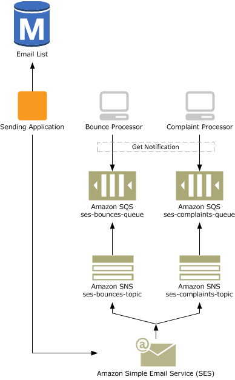

This project provides sample code on how to track bounces and complaints when using Amazon Simple Email Service (SES)
To avoid having your SES service blocked it is crucial to track bounces and complaints and update your database of customers or emails to prevent ongoing bounces.

This implementation leverages SES, SQS

All inspiration and most sample code from https://aws.amazon.com//blogs/ses/handling-bounces-and-complaints/

